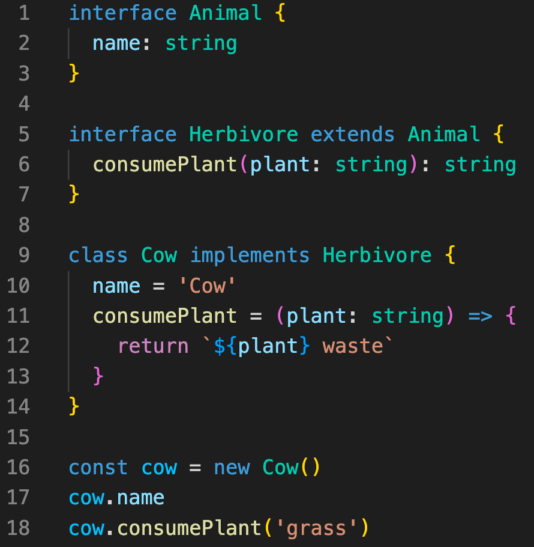
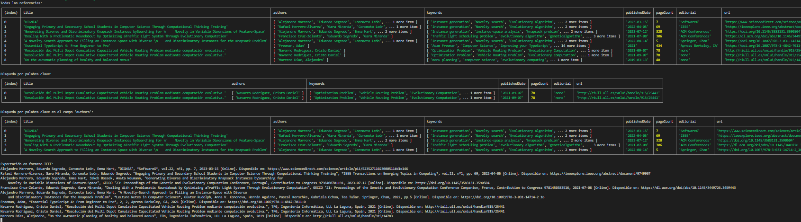

[](https://classroom.github.com/a/FvgIFuXc)

# Informe práctica 5 - Objetos, clases e interfaces



## Alejandro Javier Aguiar Pérez
> [alu0101487168@ull.edu.es](mailto:alu0101487168@ull.edu.es)

## Índice
1. [Resumen](#resumen)
2. [Principios SOLID](#principios-solid)
3. [Instanbuls y Coveralls](#instanbuls-y-coveralls)
4. [Ejercicios](#ejercicios)
   - [Ejercicio 1 Gestor de referencias bibliográficas](#ejercicio-1-gestor-de-referencias-bibliográficas)
   - [Ejercicio 2 Menús saludables orientados a objetos](#ejercicio-2-menús-saludables-orientados-a-objetos)
5. [Conclusiones](#conclusiones)
6. [Referencias](#referencias)

## Resumen
En esta práctica se desarrolló un **Gestor de Referencias Bibliográficas** en TypeScript, con el objetivo de aprender a programar orientado a objetos y aplicar los **principios SOLID**. Además se trabaja con la herramienta **Coveralls**.

> **[Volver al índice](#índice)**

## Principios SOLID
Tanto en TypeScript como en los demás lenguajes de programación existen conjuntos de normas sobre el diseño de software que promueven la creación de código limpio, modular y legible. En TypeScript se siguen los principios SOLID, estos principios son los siguientes:
- **Principio de Responsabilidad Única (SRP)**: cada clase o módulo debe tener una sola responsabilidad, lo que significa que debe realizar una tarea específica y clara. Aunque es fácil decirlo en la práctica muchas veces se complica y a veces es mejor no seguir la norma al pie de la letra.
- **Principio de Abierto/Cerrado (OCP)**: los módulos y clases deben estar abiertos para la extensión pero cerrados para la modificación directa. Esto se logra mediante la creación de interfaces y clases abstractas que se pueden extender para agregar nuevas funcionalidades sin modificar el código existente.
- **Principio de Sustitución de Liskov(LSP)**: en TypeScript, las clases derivadas deben poder sustituir a sus clases padres sin cambiar el comportamiento del programa. Esto se logra garantizando que las clases derivadas implementen las mismas interfaces o hereden correctamente los métodos y propiedades de las clases base.
- **Principio de Segregación de Interfaces (ISP)**: En TypeScript, las interfaces deben ser específicas y coherentes, evitando la dependencia de funcionalidades que no se necesitan. Esto se logra dividiendo las interfaces en interfaces más pequeñas y específicas que representan características únicas.
- **Principio de Inversión de Dependencias (DIP)**: las clases de alto nivel no deberían depender de componentes de bajo nivel, sino de una abstracción.

> **[Volver al índice](#índice)**

## Instanbuls y Coveralls
**Istanbul** y **Coveralls** son herramientas que ayudan a medir y mejorar la calidad del código en proyectos de software:
- **Istanbul**: mide qué parte del código ha sido ejecutada durante las pruebas automatizadas, proporcionando informes detallados sobre la **cobertura** de líneas, ramas e instrucciones. Ayuda a identificar áreas del código que necesitan más pruebas.
- **Coveralls**: proporciona servicios de integración continua y seguimiento de la cobertura de código a partir de las pruebas llevadas a cabo por **Mocha** y **Chai**. Recibe informes de **cobertura** de herramientas como **Istanbul** y los muestra visualmente en una **interfaz web**. Además, calcula métricas de cobertura a lo largo del tiempo y ofrece comentarios para mejorar la calidad del código. Y tiene conexión con **Github** por lo que su uso es bastante cómodo, pero tiene una desventaja y es que tienes que hacer tus repositorios públicos. Cuando queramos usar Coveralls desde *Github* debemos configurar antes un archivo .config.yml con el token asociado a la web del programa. Para usarlo en nuestro programa debemos indicarlo en el **package.json.** en el parametro *"coverage"*.
En esta práctica se profundizó sobretodo en el uso de **Coveralls**, que aunque en esta práctica no es obligatorio su uso, sí lo será en las posteriores.

> **[Volver al índice](#índice)**

## Ejercicios
### Ejercicio 1 Gestor de referencias bibliográficas
El principal objetivo del **Gestor de Referencias Bibliográficas** es proporcionar a los usuarios una herramienta eficaz para administrar y organizar información sobre referencias bibliográficas de manera flexible y fácil de usar, similar a la función que proveen programas como **Zotero** o **Mendeley**. El programa se oriento a aprender a programar en TypeScript siguiendo los **principios SOLID** anteriormente mencionados. En relación a los **principios SOLID** puedo comentar ciertos aspectos que a la hora de llevar a cabo el ejercicio he tenido en cuenta en relación:
- El programa sigue el **principio responsabilidad única (SRP)** al asignar responsabilidades únicas a cada clase y componente. Por ejemplo, cada tipo de **referencia bibliográfica** tiene su propia forma de mostrase cuando es llevada a **formato IEEE**. Aquí tenemos un ejemplo, donde la funcion printIEE() es totalmente diferente de una clase a otra:
```ts
// Clase AcademicWorks.
printIEEE(): void {
   let referenceIEEE: string = `${this.authors.join(", ")}, "${this.title}", ${
   this.academicWorkType
   }, ${this.department}, ${this.university} ${this.place}, ${
   this.country
   }, ${this.publishedDate.substring(0, 4)}`;
   // Para recursos electrónicos.
   if (this.url) {
   referenceIEEE += ` [Online]. Disponible en: ${this.url}`;
   } else {
   referenceIEEE += `.`;
   }
   console.log(referenceIEEE);
}

// Clase Patent.
printIEEE(): void {
    let referenceIEEE: string = "";
    if (this.url === undefined) {
      referenceIEEE += `${this.authors.join(", ")}, "${this.title}", ${
        this.country
      } ${this.patentNumber}, ${this.publishedDate}.`;
    } else {
      referenceIEEE += `"${this.title}", ${this.authors.join(", ")}. ${
        this.publishedDate
      }. ${this.patentNumber} [online]. Disponible: ${this.url}`;
    }
    console.log(referenceIEEE);
  }
```
- **El principio Abierto/Cerrado (OPC)** se muestra en la decisión de utilizar una *variable opcional* para indicar la existencia de una *URL* en lugar de crear una clase de referencia electrónica adicional, lo que permite extender el comportamiento de la clase base sin modificar apenas su código.
- Aunque cada tipo de referencia tiene sus propias características específicas, todas implementan la **interfaz** y **clase abstracta** común *BibliographicReference*, lo que permite tratarlas de manera homogénea en todo el programa. De esta manera se respeta en gran medida el **Principio de Sustitución de Liskov (LSP)**.
- **El principio de Segregación de la Interfaz (ISP)** se aplica al diseñar **interfaces** específicas para cada tipo de **referencia bibliográfica**, en lugar de una única interfaz genérica que incluya todos los métodos posibles.
- Las clases de referencia dependen de la **clase abstracta** *BibliographicReference* en lugar de **clases concretas**, lo que facilita la escalabilidad del programa. **Principio de Inversión de Dependencias (DIP)**

Otras notas que he ido apuntando mientras hacía el programa han sido:
- **Uso del atributo "in" para diferenciar entre tipos de referencias**: Se consideró utilizar el atributo "in" para distinguir entre diferentes tipos de referencias, lo que habría facilitado la gestión de los datos. Sin embargo, se optó por una solución más flexible que utiliza una variable opcional para indicar la existencia de una URL en la clase base, lo que permite adaptarse a diferentes casos de uso sin introducir complejidad adicional.
- **Problemas con la nomenclatura de la interfaz y la clase**: Surgió un problema durante el desarrollo del programa debido al uso del mismo nombre para la **interfaz** *BibliographicReference* y la **clase abstracta** *BibliographicReference*. Esto causó conflictos en el uso de métodos abstractos, lo que llevó tiempo resolver.
- **Dificultades para realizar pruebas unitarias**: Dado que el programa se centra principalmente en la salida por pantalla y las funciones son del tipo *void*, resultó difícil encontrar una manera efectiva de realizar **pruebas unitarias** que verifiquen su funcionamiento. En su lugar, se creó un archivo de ejemplo *example.ts* para demostrar el funcionamiento del programa. Los únicos tests implementados son para comprobar que el programa detecte las fechas incorrectas con nomenclatura inglesa (YYYY-MM-DD).
- **Uso de las propiedades de console.table()**: Se utilizaron las propiedades de *console.table()* para controlar qué datos se muestran en la tabla, ya que si la columna referente a los resumenes se mostraba no había manera de entender lo que salía por pantalla.

El resultado final de este ejercicio es el que se meustra en la siguiente imagen:



> **[Volver al índice](#índice)**

### Ejercicio 2 Menús saludables orientados a objetos
**NO REALIZADO**

> **[Volver al índice](#índice)**

## Conclusiones
Aunque no he llegado a completar el ejercicio 2, creo que he adquirido algo más de familiarización con TypeScript y además he aprendido sobre los **principios SOLID** que son muy útiles para no acabar con el famoso código *spaguetti*.Además de una nueva herramienta para cubrir código como lo es **Coveralls**.

> **[Volver al índice](#índice)**

## Referencias
[Istanbul](#https://istanbul.js.org)
[Principios SOLID](#https://samueleresca.net/solid-principles-using-typescript/)
[Coveralls](https://coveralls.io/repos/new)
[Formato IEEE](https://ull-es.libguides.com/c.php?g=674761&p=4808130) 
[table()](https://developer.mozilla.org/es/docs/Web/API/console/table_static)
[Expresión regular fechas](https://w3.unpocodetodo.info/utiles/regex-ejemplos.php?type=fechas)

> **[Volver al índice](#índice)**